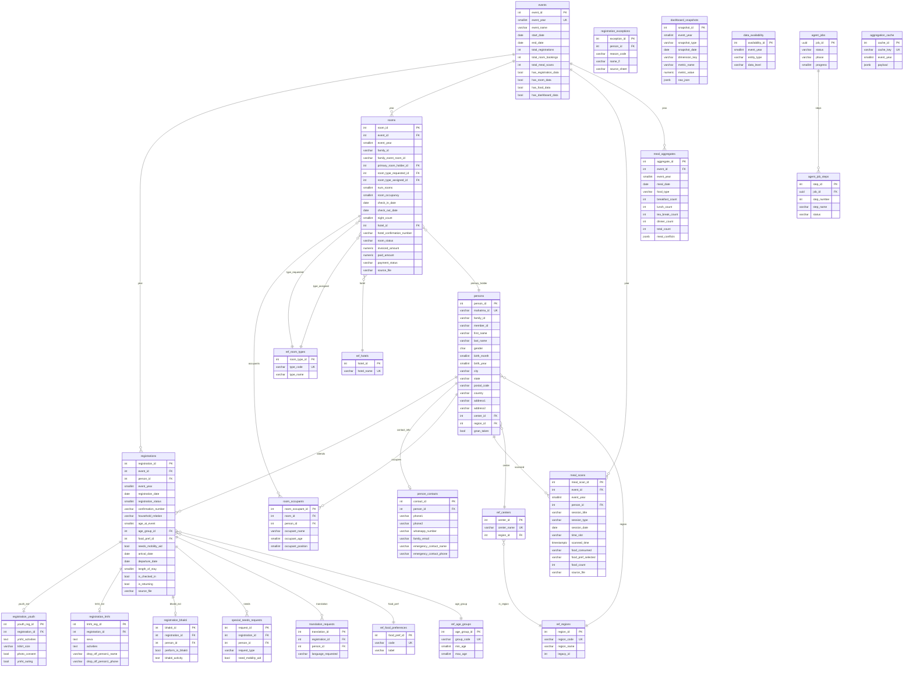

# GP Event Data — PostgreSQL Schema & ETL Plan

## Context

Multi-year GP (Guru Purnima) event data spanning 2022-2025 across 9 xlsx files is unorganized and inconsistent. Column names, formats, and structures differ between years. The goal is a normalized PostgreSQL database that enables clean multi-year analysis and an interactive dashboard.

This plan replaces the Convex DB approach from the PRD with a properly normalized relational PostgreSQL schema.

---

## 1. Common Entities Across Years

### Entity: REGISTRATIONS (Attendees)
| Column Concept | 2022 | 2023 | 2024 | 2025 |
|---|---|---|---|---|
| First Name | `FirstName` | `FirstName` | -- | `FirstName` |
| Last Name | `LastName` | `LastName` | -- | `LastName` |
| Gender | `Gender` (M/F) | `Gender` | -- | `GenderMF` (Male/Female) |
| Age | `BirthMonth`+`BirthYear`+`AgeWhenEventStarts` | same | -- | `AgeAtEvent`+`AgeGroup` |
| City | `City` | `City` | -- | `City` |
| State | `State` | `State` | -- | `StateOrProvince` |
| Postal Code | `Zipcode` | `Zipcode` | -- | `PostalCode` |
| Country | `Country` | `Country` | -- | `Country` |
| Center | `CenterName` | `CenterName` | -- | `CenterName` |
| Region | `regionID` (numeric) | `regionID` | -- | `Region` (string: "North Central") |
| Registration Date | `RegistrationDate` | `RegistrationDate` | -- | `RegistrationDate` |
| Food Preference | `FoodPref` (full text) | `FoodPref` | -- | `Food Preference` (code: R/J/JW/RW) |
| Phone | `Phone1`+`Phone2` | `Phone1`+`Phone2` | -- | `Phone` |
| Email | `FamilyEmailAddress` | `FamilyEmailAddress` | -- | -- |
| Family ID | `FamilyID` | `FamilyID` | -- | `FamilyID` |
| Gnan Status | `GnanTaken`/`GnanLanguage`/`GnanDate` | same | -- | `HasGnanTaken` |
| Mobility | `WheelChairRequest` | `WheelChairRequest` | -- | `Need Mobility Aid` |
| Arrival | `ArrivalDate` | `ArrivalDate` | -- | One-hot booleans per date |
| Departure | `DepartureDate` | `DepartureDate` | -- | One-hot booleans per date |
| Confirmation | `ConfirmationNumber` | `ConfirmationNumber` | -- | -- |

**2025-only fields**: `MahatmaID`, `HouseholdRelation`, `Address1/2`, `MemberID`, `MemberEventID`, `RegistrationStatus`, `Special Assistance`, `Mode of Transport`, `Translation`, `WhatsApp Number`, `Emergency Contact`, `Dietary Restrictions`, `Bhakti` fields, youth fields (YMHT/LMHT activities, t-shirt, photo consent)

### Entity: ROOMS
| Column Concept | 2022 | 2023 | 2025 |
|---|---|---|---|
| Room ID | `EventFamilyRoomID` | `EventFamilyRoomID` | `FamilyEventRoomID` |
| Type Requested | `RoomReuqested` (typo) | `RoomReuqested` | `RoomTypeRequested` |
| Type Assigned | `RoomTypePickedUp`/`PickedUpRoomType` | same | `RoomTypeAssigned` |
| Check-in | `RoomCheckInDate` | `RoomCheckInDate` | `CheckInDate` (+`FinalCheckInDate`) |
| Check-out | `RoomCheckOutDate` | `RoomCheckOutDate` | `CheckOutDate` (+`FinalCheckOutDate`) |
| Occupancy | `RoomOccupancy` | `RoomOccupancy` | `Occupants` + `O1-O4Age` |
| Hotel | `HotelName` (stats sheet) | `HotelName` | `HotelAssigned` |
| Confirmation | `HotelConfirmationNumber` | same | `FinalHotelConfirmationNumber` |
| Status | `RoomRequested`/`RoomPickedUp` (boolean) | same | `RoomStatus` (string) |

**2025-only**: `NoOfRooms`, `RoomGroupAssigned`, `IsAccessible`, `IsRollingShower`, `IsSeniorNotSharingBeds`, `SpecialNeedsText`, `InvoicedAmount`, `PaidAmount`, `PaymentStatus`, `PaidBy`, `ProcessingFees`, `OccupantsInfo`

### Entity: FOOD/MEALS
| Column Concept | 2022 | 2024 | 2025 |
|---|---|---|---|
| Meal Type | `SessionTitle` (Lunch/Dinner/etc) | implicit (Breakfast/Lunch/etc columns) | `SessionTitle` |
| Date | `SessionDate` | day in section header | `ScannedOnDate` |
| Time | `TimeSlot` | -- | `TimeSlot15Min` |
| Food Type | `FoodConsumed` (Regular/Jain/Western) | `FoodConsumed` | `Tag` (Regular/Jain/Western/Handicap) |
| Preference | `FoodPrefSelected` | -- | -- |
| Granularity | **Aggregated** (FoodCount per group) | **Aggregated** (daily totals) | **Individual** (per scan) |
| Person Link | None (by AgeGroup+Gender) | None | `MahatmaID`+`NameFL`+`Phone` |
| 2023: **NO FOOD DATA** |

---

## 2. Year-Specific Auxiliary Data

### 2022 Aux
- `IsSevarthiFamilyMember`, `IsPaymentReceived`, `PaymentAmount`
- `IsCheckedIn`, `CheckedInTime`
- `WMHTID`, `GnanLanguage`, `GnanDate`
- Food: `Guru Pujan Stats` (timeslot counts), `Pivot Data - Gurupujan` (404 rows)

### 2023 Aux
- Same structure as 2022 (identical column set)
- `MHTs Attended by GnanLanguage` sheet (empty)

### 2024 Aux
- Dashboard-only year: `gp2024_event_dashboard.xlsx` (registration summary, hotel pickup by date, food pref dashboard, Sevarthi Shibir meal counts)
- Food scanning: `gp2024_scanning_analysis.xlsx` (daily aggregated meal counts + meal conflict matrices)

### 2025 Aux (richest year)
- **Youth Programs**: `BMHT+LMHT Registrations` (172 rows, ages 4-12), `YMHT Registrations` (155 rows, ages 13-17)
- **Bhakti**: `Bhakti Data Captured` (170 rows — performance sign-ups)
- **Special Needs**: `Special Needs Requests` (133 rows)
- **Translation**: `Translation Requests` (535 rows)
- **Exceptions**: `Exceptions` (260 rows), `AC-no-GP` (113 rows), `GP-no-12` (148 rows)
- **Expanded**: `Registrations Expanded` (11,171 rows, 161 one-hot cols) — redundant with "Data" sheet

---

## 3. Data Discrepancy Matrix

### Availability Heatmap

```
                  Registration    Rooms         Food/Meals    Dashboard
  2022            INDIVIDUAL      INDIVIDUAL    AGGREGATED    NONE
                  2,657 rows      828 stats     6,015 pivot
                  54 cols         22 cols       10 cols

  2023            INDIVIDUAL      INDIVIDUAL    ██ MISSING    NONE
                  3,574 rows      886 stats
                  54 cols         22 cols

  2024            ██ MISSING      ██ MISSING    AGGREGATED    AVAILABLE
                  (summary only)  (summary)     216 rows      575 rows
                                                daily totals

  2025            INDIVIDUAL      INDIVIDUAL    INDIVIDUAL    AVAILABLE
                  4,076 + 327     1,344 + 1,324 46,755 scans  224 rows
                  youth           overlap
                  54+ cols        35-40 cols    13 cols
```

### Column Availability Per Entity Per Year

```
REGISTRATIONS           2022  2023  2024  2025
─────────────────────── ───── ───── ───── ─────
Name/Gender/Age           Y     Y    --     Y
City/State/Country        Y     Y    --     Y
Phone/Email               Y     Y    --    Y(phone only)
Center/Region             Y     Y    --     Y
FoodPref                  Y     Y    --     Y
Arrival/Departure         Y     Y    --    Y(one-hot)
ConfirmationNumber        Y     Y    --    --
BirthMonth/BirthYear      Y     Y    --    --
MahatmaID                --    --    --     Y
HouseholdRelation        --    --    --     Y
Address                  --    --    --     Y
AgeGroup                 --    --    --     Y
Region (string)          --    --    --     Y
EmergencyContact         --    --    --     Y
WhatsApp                 --    --    --     Y
ModeOfTransport          --    --    --     Y
Youth/LMHT fields        --    --    --     Y

ROOMS                   2022  2023  2024  2025
─────────────────────── ───── ───── ───── ─────
RoomType (req/assigned)   Y     Y    --     Y
CheckIn/CheckOut          Y     Y    --     Y
Occupancy                 Y     Y    --     Y
HotelName                 Y     Y    --     Y
HotelConfirmation         Y     Y    --     Y
RoomStatus (bool)         Y     Y    --    --
RoomStatus (string)      --    --    --     Y
Financial (payment)      --    --    --     Y
Accessibility flags      --    --    --     Y
OccupantAges             --    --    --     Y
RoomGroup                --    --    --     Y

FOOD/MEALS              2022  2023  2024  2025
─────────────────────── ───── ───── ───── ─────
Per-person scans         --    --    --     Y
Aggregated counts         Y    --     Y    --
MealType                  Y    --    (impl) Y
TimeSlot                  Y    --    --     Y
FoodPrefSelected          Y    --    --    --
AgeGroup/Gender           Y    --    --    --
MealConflicts            --    --     Y    --
```

### Imputation Strategy

| Gap | Strategy |
|-----|----------|
| 2023 food data | Mark as `data_level = 'none'` in `data_availability`. Dashboard shows "Not Available" banner. Cannot impute. |
| 2024 registration/room raw data | Use `dashboard_snapshots` for aggregate totals. Individual queries return empty with explanation. |
| 2022/2023 missing MahatmaID | Cross-reference by `FamilyID + LOWER(first_name) + LOWER(last_name)` against 2025 persons to backfill where possible |
| 2025 missing BirthMonth/BirthYear | Cannot impute — only `AgeAtEvent` available. Store age, leave birth fields NULL |
| 2025 missing FamilyEmailAddress | Not collected in 2025 registration system. Leave NULL |
| 2022/2023 missing Address | Not collected. Leave NULL |
| 2025 arrival/departure dates | Parse one-hot boolean columns ("First Day at GP - 2025-07-05" etc.) to derive dates |

---

## 4. PostgreSQL Schema

### Table Classification

**CORE (6)**: `events`, `persons`, `person_contacts`, `registrations`, `rooms`, `room_occupants`, `meal_scans`
**AUX (8)**: `registration_youth`, `registration_lmht`, `registration_bhakti`, `special_needs_requests`, `translation_requests`, `registration_exceptions`, `dashboard_snapshots`, `meal_aggregates`
**REFERENCE (6)**: `ref_regions`, `ref_centers`, `ref_food_preferences`, `ref_room_types`, `ref_age_groups`, `ref_hotels`
**SYSTEM (5)**: `agent_jobs`, `agent_job_steps`, `aggregation_cache`, `data_availability`, `user_preferences`

### SQL DDL

```sql
-- ===================== REFERENCE TABLES =====================

CREATE TABLE ref_regions (
    region_id       SERIAL PRIMARY KEY,
    region_code     VARCHAR(10) UNIQUE NOT NULL,
    region_name     VARCHAR(50) NOT NULL,
    legacy_id       INTEGER,
    created_at      TIMESTAMPTZ DEFAULT NOW()
);

CREATE TABLE ref_centers (
    center_id       SERIAL PRIMARY KEY,
    center_name     VARCHAR(200) UNIQUE NOT NULL,
    region_id       INTEGER REFERENCES ref_regions(region_id),
    state           VARCHAR(100),
    country         VARCHAR(100) DEFAULT 'USA',
    created_at      TIMESTAMPTZ DEFAULT NOW()
);

CREATE TABLE ref_food_preferences (
    food_pref_id    SERIAL PRIMARY KEY,
    code            VARCHAR(10) UNIQUE NOT NULL,
    label           VARCHAR(100) NOT NULL,
    description     TEXT,
    created_at      TIMESTAMPTZ DEFAULT NOW()
);

CREATE TABLE ref_room_types (
    room_type_id    SERIAL PRIMARY KEY,
    type_code       VARCHAR(20) UNIQUE NOT NULL,
    type_name       VARCHAR(100) NOT NULL,
    created_at      TIMESTAMPTZ DEFAULT NOW()
);

CREATE TABLE ref_age_groups (
    age_group_id    SERIAL PRIMARY KEY,
    group_code      VARCHAR(20) UNIQUE NOT NULL,
    min_age         INTEGER,
    max_age         INTEGER,
    label           VARCHAR(50) NOT NULL,
    created_at      TIMESTAMPTZ DEFAULT NOW()
);

CREATE TABLE ref_hotels (
    hotel_id        SERIAL PRIMARY KEY,
    hotel_name      VARCHAR(200) UNIQUE NOT NULL,
    created_at      TIMESTAMPTZ DEFAULT NOW()
);

-- ===================== CORE TABLES =====================

CREATE TABLE events (
    event_id                SERIAL PRIMARY KEY,
    event_year              SMALLINT UNIQUE NOT NULL,
    event_name              VARCHAR(100) NOT NULL,
    start_date              DATE,
    end_date                DATE,
    total_registrations     INTEGER DEFAULT 0,
    total_room_bookings     INTEGER DEFAULT 0,
    total_meal_scans        INTEGER DEFAULT 0,
    has_registration_data   BOOLEAN DEFAULT FALSE,
    has_room_data           BOOLEAN DEFAULT FALSE,
    has_food_data           BOOLEAN DEFAULT FALSE,
    has_dashboard_data      BOOLEAN DEFAULT FALSE,
    notes                   TEXT,
    created_at              TIMESTAMPTZ DEFAULT NOW(),
    updated_at              TIMESTAMPTZ DEFAULT NOW()
);

CREATE TABLE persons (
    person_id       SERIAL PRIMARY KEY,
    mahatma_id      VARCHAR(50) UNIQUE,
    family_id       VARCHAR(50),
    member_id       VARCHAR(50),
    first_name      VARCHAR(100) NOT NULL,
    last_name       VARCHAR(100) NOT NULL,
    gender          CHAR(1),
    birth_month     SMALLINT,
    birth_year      SMALLINT,
    city            VARCHAR(100),
    state           VARCHAR(100),
    postal_code     VARCHAR(20),
    country         VARCHAR(100) DEFAULT 'USA',
    address1        VARCHAR(200),
    address2        VARCHAR(200),
    center_id       INTEGER REFERENCES ref_centers(center_id),
    region_id       INTEGER REFERENCES ref_regions(region_id),
    gnan_taken      BOOLEAN,
    gnan_language   VARCHAR(50),
    gnan_date       DATE,
    created_at      TIMESTAMPTZ DEFAULT NOW(),
    updated_at      TIMESTAMPTZ DEFAULT NOW()
);

CREATE TABLE person_contacts (
    contact_id              SERIAL PRIMARY KEY,
    person_id               INTEGER NOT NULL REFERENCES persons(person_id) ON DELETE CASCADE,
    phone1                  VARCHAR(20),
    phone2                  VARCHAR(20),
    whatsapp_number         VARCHAR(20),
    family_email            VARCHAR(200),
    youth_email             VARCHAR(200),
    youth_cell_phone        VARCHAR(20),
    emergency_contact_name  VARCHAR(200),
    emergency_contact_phone VARCHAR(20),
    created_at              TIMESTAMPTZ DEFAULT NOW()
);

CREATE TABLE registrations (
    registration_id     SERIAL PRIMARY KEY,
    event_id            INTEGER NOT NULL REFERENCES events(event_id),
    person_id           INTEGER NOT NULL REFERENCES persons(person_id),
    event_year          SMALLINT NOT NULL,
    registration_date   DATE,
    registration_status SMALLINT,
    confirmation_number VARCHAR(50),
    member_event_id     VARCHAR(50),
    household_relation  VARCHAR(50),
    age_at_event        SMALLINT,
    age_group_id        INTEGER REFERENCES ref_age_groups(age_group_id),
    food_pref_id        INTEGER REFERENCES ref_food_preferences(food_pref_id),
    needs_mobility_aid  BOOLEAN DEFAULT FALSE,
    special_assistance  TEXT,
    arrival_date        DATE,
    departure_date      DATE,
    length_of_stay      SMALLINT,
    is_checked_in       BOOLEAN,
    checked_in_time     TIMESTAMPTZ,
    mode_of_transport   VARCHAR(100),
    translation_needed  VARCHAR(100),
    dietary_restrictions TEXT,
    is_returning        BOOLEAN,
    source_file         VARCHAR(200) NOT NULL,
    source_sheet        VARCHAR(100),
    UNIQUE (event_id, person_id),
    created_at          TIMESTAMPTZ DEFAULT NOW(),
    updated_at          TIMESTAMPTZ DEFAULT NOW()
);

CREATE TABLE rooms (
    room_id                     SERIAL PRIMARY KEY,
    event_id                    INTEGER NOT NULL REFERENCES events(event_id),
    event_year                  SMALLINT NOT NULL,
    family_id                   VARCHAR(50),
    family_event_room_id        VARCHAR(50),
    primary_room_holder_id      INTEGER REFERENCES persons(person_id),
    room_type_requested_id      INTEGER REFERENCES ref_room_types(room_type_id),
    room_type_assigned_id       INTEGER REFERENCES ref_room_types(room_type_id),
    num_rooms                   SMALLINT DEFAULT 1,
    room_occupancy              SMALLINT,
    check_in_date               DATE,
    check_out_date              DATE,
    final_check_in_date         DATE,
    final_check_out_date        DATE,
    night_count                 SMALLINT,
    room_requested_date         DATE,
    hotel_id                    INTEGER REFERENCES ref_hotels(hotel_id),
    room_group_assigned         VARCHAR(100),
    hotel_confirmation_number   VARCHAR(100),
    room_requested              BOOLEAN,
    room_picked_up              BOOLEAN,
    room_status                 VARCHAR(50),
    is_room_booked              BOOLEAN,
    is_accessible               BOOLEAN DEFAULT FALSE,
    is_rolling_shower           BOOLEAN DEFAULT FALSE,
    is_senior_not_sharing_beds  BOOLEAN DEFAULT FALSE,
    special_needs_text          TEXT,
    invoiced_amount             NUMERIC(10,2),
    paid_amount                 NUMERIC(10,2),
    payment_status              VARCHAR(50),
    paid_by                     VARCHAR(200),
    processing_fees             NUMERIC(10,2),
    payment_net_amount          NUMERIC(10,2),
    min_age                     SMALLINT,
    max_age                     SMALLINT,
    occupants_info              TEXT,
    additional_comments         TEXT,
    source_file                 VARCHAR(200) NOT NULL,
    source_sheet                VARCHAR(100),
    created_at                  TIMESTAMPTZ DEFAULT NOW(),
    updated_at                  TIMESTAMPTZ DEFAULT NOW()
);

CREATE TABLE room_occupants (
    room_occupant_id    SERIAL PRIMARY KEY,
    room_id             INTEGER NOT NULL REFERENCES rooms(room_id) ON DELETE CASCADE,
    person_id           INTEGER REFERENCES persons(person_id),
    occupant_name       VARCHAR(200),
    occupant_age        SMALLINT,
    occupant_position   SMALLINT,
    created_at          TIMESTAMPTZ DEFAULT NOW()
);

CREATE TABLE meal_scans (
    meal_scan_id        SERIAL PRIMARY KEY,
    event_id            INTEGER NOT NULL REFERENCES events(event_id),
    event_year          SMALLINT NOT NULL,
    person_id           INTEGER REFERENCES persons(person_id),
    session_title       VARCHAR(200),
    session_type        VARCHAR(50),
    session_date        DATE,
    time_slot           VARCHAR(50),
    scanned_time        TIMESTAMPTZ,
    tag                 VARCHAR(50),
    display_order       INTEGER,
    age_group_code      VARCHAR(20),
    gender              CHAR(1),
    food_pref_selected  VARCHAR(50),
    food_consumed       VARCHAR(50),
    is_new_mahatma      BOOLEAN,
    food_count          INTEGER DEFAULT 1,
    center_name         VARCHAR(200),
    state_or_province   VARCHAR(100),
    country             VARCHAR(100),
    mms_member_id       VARCHAR(50),
    source_file         VARCHAR(200) NOT NULL,
    source_sheet        VARCHAR(100),
    created_at          TIMESTAMPTZ DEFAULT NOW()
);

-- ===================== AUX TABLES =====================

CREATE TABLE registration_youth (
    youth_reg_id        SERIAL PRIMARY KEY,
    registration_id     INTEGER NOT NULL REFERENCES registrations(registration_id) ON DELETE CASCADE,
    ymht_activities     TEXT,
    youth_cell_phone    VARCHAR(20),
    youth_email         VARCHAR(200),
    photo_consent       BOOLEAN,
    tshirt_size         VARCHAR(10),
    ymht_outing         BOOLEAN,
    created_at          TIMESTAMPTZ DEFAULT NOW()
);

CREATE TABLE registration_lmht (
    lmht_reg_id         SERIAL PRIMARY KEY,
    registration_id     INTEGER NOT NULL REFERENCES registrations(registration_id) ON DELETE CASCADE,
    seva                TEXT,
    activities          TEXT,
    drop_off_person1_name  VARCHAR(200),
    drop_off_person1_phone VARCHAR(30),
    drop_off_person2_name  VARCHAR(200),
    drop_off_person2_phone VARCHAR(30),
    dietary_restrictions   TEXT,
    created_at          TIMESTAMPTZ DEFAULT NOW()
);

CREATE TABLE registration_bhakti (
    bhakti_id               SERIAL PRIMARY KEY,
    registration_id         INTEGER REFERENCES registrations(registration_id) ON DELETE CASCADE,
    person_id               INTEGER REFERENCES persons(person_id),
    event_year              SMALLINT NOT NULL DEFAULT 2025,
    perform_in_bhakti       BOOLEAN,
    previous_bhakti_audition VARCHAR(20),
    other_audition_event    TEXT,
    bhakti_activity         TEXT,
    source_file             VARCHAR(200),
    created_at              TIMESTAMPTZ DEFAULT NOW()
);

CREATE TABLE special_needs_requests (
    request_id          SERIAL PRIMARY KEY,
    registration_id     INTEGER REFERENCES registrations(registration_id) ON DELETE CASCADE,
    person_id           INTEGER REFERENCES persons(person_id),
    event_year          SMALLINT NOT NULL,
    request_type        VARCHAR(100),
    need_mobility_aid   BOOLEAN,
    bring_own_aid       BOOLEAN,
    accompanying        VARCHAR(200),
    rental_option       VARCHAR(100),
    request_details     TEXT,
    source_file         VARCHAR(200),
    created_at          TIMESTAMPTZ DEFAULT NOW()
);

CREATE TABLE translation_requests (
    translation_id      SERIAL PRIMARY KEY,
    registration_id     INTEGER REFERENCES registrations(registration_id) ON DELETE CASCADE,
    person_id           INTEGER REFERENCES persons(person_id),
    event_year          SMALLINT NOT NULL DEFAULT 2025,
    language_requested  VARCHAR(100),
    mode_of_transport   VARCHAR(100),
    source_file         VARCHAR(200),
    created_at          TIMESTAMPTZ DEFAULT NOW()
);

CREATE TABLE registration_exceptions (
    exception_id        SERIAL PRIMARY KEY,
    person_id           INTEGER REFERENCES persons(person_id),
    event_year          SMALLINT NOT NULL DEFAULT 2025,
    reason_code         VARCHAR(50),
    gp_checkout_date    DATE,
    mahatma_id          VARCHAR(50),
    name_fl             VARCHAR(200),
    email               VARCHAR(200),
    phone               VARCHAR(30),
    center_name         VARCHAR(200),
    state               VARCHAR(100),
    country             VARCHAR(100),
    global_region       VARCHAR(50),
    source_sheet        VARCHAR(100),
    source_file         VARCHAR(200),
    created_at          TIMESTAMPTZ DEFAULT NOW()
);

CREATE TABLE dashboard_snapshots (
    snapshot_id         SERIAL PRIMARY KEY,
    event_year          SMALLINT NOT NULL,
    snapshot_type       VARCHAR(100) NOT NULL,
    snapshot_date       DATE,
    dimension_key       VARCHAR(200),
    dimension_value     VARCHAR(200),
    metric_name         VARCHAR(100) NOT NULL,
    metric_value        NUMERIC(12,2),
    raw_json            JSONB,
    source_file         VARCHAR(200) NOT NULL,
    source_sheet        VARCHAR(100),
    created_at          TIMESTAMPTZ DEFAULT NOW()
);

CREATE TABLE meal_aggregates (
    aggregate_id        SERIAL PRIMARY KEY,
    event_id            INTEGER NOT NULL REFERENCES events(event_id),
    event_year          SMALLINT NOT NULL,
    meal_date           DATE NOT NULL,
    food_type           VARCHAR(50),
    breakfast_count     INTEGER,
    lunch_count         INTEGER,
    tea_break_count     INTEGER,
    dinner_count        INTEGER,
    total_count         INTEGER,
    meal_conflicts      JSONB,
    source_file         VARCHAR(200) NOT NULL,
    source_sheet        VARCHAR(100),
    created_at          TIMESTAMPTZ DEFAULT NOW()
);

-- ===================== SYSTEM TABLES =====================

CREATE TABLE data_availability (
    availability_id     SERIAL PRIMARY KEY,
    event_year          SMALLINT NOT NULL,
    entity_type         VARCHAR(50) NOT NULL,
    data_level          VARCHAR(20) NOT NULL,
    source_files        TEXT[],
    row_count           INTEGER,
    notes               TEXT,
    UNIQUE (event_year, entity_type)
);

CREATE TABLE agent_jobs (
    job_id          UUID PRIMARY KEY DEFAULT gen_random_uuid(),
    status          VARCHAR(20) NOT NULL DEFAULT 'queued',
    phase           VARCHAR(30),
    progress        SMALLINT DEFAULT 0,
    current_step    VARCHAR(500),
    files_processed TEXT[],
    errors          TEXT[],
    started_at      TIMESTAMPTZ NOT NULL DEFAULT NOW(),
    completed_at    TIMESTAMPTZ,
    report_path     VARCHAR(500)
);

CREATE TABLE agent_job_steps (
    step_id         SERIAL PRIMARY KEY,
    job_id          UUID NOT NULL REFERENCES agent_jobs(job_id) ON DELETE CASCADE,
    step_number     INTEGER NOT NULL,
    step_name       VARCHAR(200) NOT NULL,
    status          VARCHAR(20) NOT NULL DEFAULT 'pending',
    records_processed INTEGER DEFAULT 0,
    records_skipped   INTEGER DEFAULT 0,
    error_message   TEXT,
    started_at      TIMESTAMPTZ,
    completed_at    TIMESTAMPTZ
);

CREATE TABLE aggregation_cache (
    cache_id        SERIAL PRIMARY KEY,
    cache_key       VARCHAR(200) UNIQUE NOT NULL,
    event_year      SMALLINT,
    data_type       VARCHAR(20) NOT NULL,
    payload         JSONB NOT NULL,
    computed_at     TIMESTAMPTZ NOT NULL DEFAULT NOW()
);

CREATE TABLE user_preferences (
    preference_id       SERIAL PRIMARY KEY,
    session_id          VARCHAR(100) UNIQUE NOT NULL,
    selected_years      SMALLINT[],
    selected_regions    TEXT[],
    selected_room_types TEXT[],
    date_range_start    DATE,
    date_range_end      DATE,
    active_tab          VARCHAR(50),
    updated_at          TIMESTAMPTZ DEFAULT NOW()
);

-- ===================== INDEXES =====================

CREATE INDEX idx_persons_mahatma_id ON persons(mahatma_id) WHERE mahatma_id IS NOT NULL;
CREATE INDEX idx_persons_family_id ON persons(family_id);
CREATE INDEX idx_persons_name ON persons(last_name, first_name);
CREATE INDEX idx_persons_center ON persons(center_id);
CREATE INDEX idx_persons_region ON persons(region_id);

CREATE INDEX idx_registrations_event_year ON registrations(event_year);
CREATE INDEX idx_registrations_event_person ON registrations(event_id, person_id);
CREATE INDEX idx_registrations_arrival ON registrations(arrival_date);
CREATE INDEX idx_registrations_age_group ON registrations(age_group_id, event_year);
CREATE INDEX idx_registrations_food_pref ON registrations(food_pref_id, event_year);

CREATE INDEX idx_rooms_event_year ON rooms(event_year);
CREATE INDEX idx_rooms_check_in ON rooms(check_in_date);
CREATE INDEX idx_rooms_hotel ON rooms(hotel_id, event_year);
CREATE INDEX idx_rooms_family ON rooms(family_id, event_year);
CREATE INDEX idx_rooms_type_assigned ON rooms(room_type_assigned_id, event_year);

CREATE INDEX idx_room_occupants_room ON room_occupants(room_id);
CREATE INDEX idx_room_occupants_person ON room_occupants(person_id);

CREATE INDEX idx_meal_scans_event_year ON meal_scans(event_year);
CREATE INDEX idx_meal_scans_date ON meal_scans(session_date, event_year);
CREATE INDEX idx_meal_scans_person ON meal_scans(person_id) WHERE person_id IS NOT NULL;
CREATE INDEX idx_meal_scans_session ON meal_scans(session_title, event_year);

CREATE INDEX idx_meal_agg_year_date ON meal_aggregates(event_year, meal_date);
CREATE INDEX idx_dash_snapshot_year_type ON dashboard_snapshots(event_year, snapshot_type);
CREATE INDEX idx_data_avail_year ON data_availability(event_year);
CREATE INDEX idx_agent_jobs_status ON agent_jobs(status);
CREATE INDEX idx_agg_cache_key ON aggregation_cache(cache_key);
```

---

## 5. Source-to-Table Mapping

| Source File | Sheet | Target Table(s) | ETL Notes |
|---|---|---|---|
| gp2022_registrations...xlsx | Registration-CheckIn-RoomAcc by | `persons` + `person_contacts` + `registrations` + `rooms` | Split 54-col rows: cols 1-44 → person+registration, cols 45-54 → rooms |
| gp2022_registrations...xlsx | Room Stats - Booked vs Pickedup | `rooms` (enrich hotel info) | Match by name+family to add HotelName, HotelConfirmation |
| gp2022_food_preferences.xlsx | Pivot Data - ALL | `meal_scans` | `food_count` = FoodCount column; no person_id link |
| gp2022_food_preferences.xlsx | Summary/chart sheets | `dashboard_snapshots` | Pre-aggregated stats |
| gp2023_event_registrations...xlsx | Both sheets | Same as 2022 | Identical structure |
| gp2024_event_dashboard.xlsx | All 6 sheets | `dashboard_snapshots` | Unpivot date columns → rows |
| gp2024_scanning_analysis.xlsx | Food Consumed Stats - 1 | `meal_aggregates` | Parse repeated date-header blocks |
| gp2024_scanning_analysis.xlsx | Food Consumed Stats - 2 | `meal_aggregates` (meal_conflicts JSONB) | Conflict matrices |
| gp2025_registrations.xlsx | Data | `persons` + `person_contacts` + `registrations` | MahatmaID as dedup key |
| gp2025_registrations.xlsx | BMHT+LMHT Registrations | `persons` + `registrations` + `registration_lmht` | Ages 4-12 |
| gp2025_registrations.xlsx | YMHT Registrations | `persons` + `registrations` + `registration_youth` | Ages 13-17 |
| gp2025_registrations.xlsx | Bhakti Data Captured | `registration_bhakti` | Link via person_id |
| gp2025_registrations.xlsx | Rooms | `rooms` + `room_occupants` | Merge with room_analysis via FamilyEventRoomID |
| gp2025_registrations.xlsx | Special Needs Requests | `special_needs_requests` | Link via person_id |
| gp2025_registrations.xlsx | Translation Requests | `translation_requests` | Link via person_id |
| gp2025_registrations.xlsx | Exceptions/AC-no-GP/GP-no-12 | `registration_exceptions` | Data quality tracking |
| gp2025_registrations.xlsx | Registrations Expanded | **SKIP** | Redundant one-hot of "Data" sheet |
| gp2025_food_preferences.xlsx | All Data | `meal_scans` | Individual scans, `food_count` = 1 |
| gp2025_room_analysis.xlsx | Data | `rooms` + `room_occupants` | Base room data; merge with registrations "Rooms" sheet |
| gp2025_event_dashboard.xlsx | Both sheets | `dashboard_snapshots` | Unpivot date columns → rows |

---

## 6. Mermaid ER Diagram



---

## 7. Verification Plan

1. **Schema validation**: Run the DDL against a local PostgreSQL instance, verify all tables, FKs, and indexes create successfully
2. **Seed reference tables**: Populate `ref_regions`, `ref_centers`, `ref_food_preferences`, `ref_room_types`, `ref_age_groups`, `ref_hotels` from xlsx data
3. **ETL smoke test**: Load one year (2022) end-to-end into all applicable tables, verify row counts match source
4. **Cross-year query test**: After loading 2022+2023+2025, run returning-attendee detection query to verify person dedup works
5. **Data availability check**: Query `data_availability` table to confirm the discrepancy matrix matches expected gaps
6. **Mermaid render**: Paste the mermaid block into a mermaid renderer to verify the ER diagram renders correctly

### Critical Files
- `/Users/adityat/Documents/Projects/gpdash/docs/PRD.md` — Update to reference PostgreSQL schema instead of Convex
- `/Users/adityat/Documents/Projects/gpdash/docs/event_docs/*.xlsx` — 9 source files
- `/Users/adityat/Documents/Projects/gpdash/tmp/phase1_report.json` — Existing discovery data with column metadata
